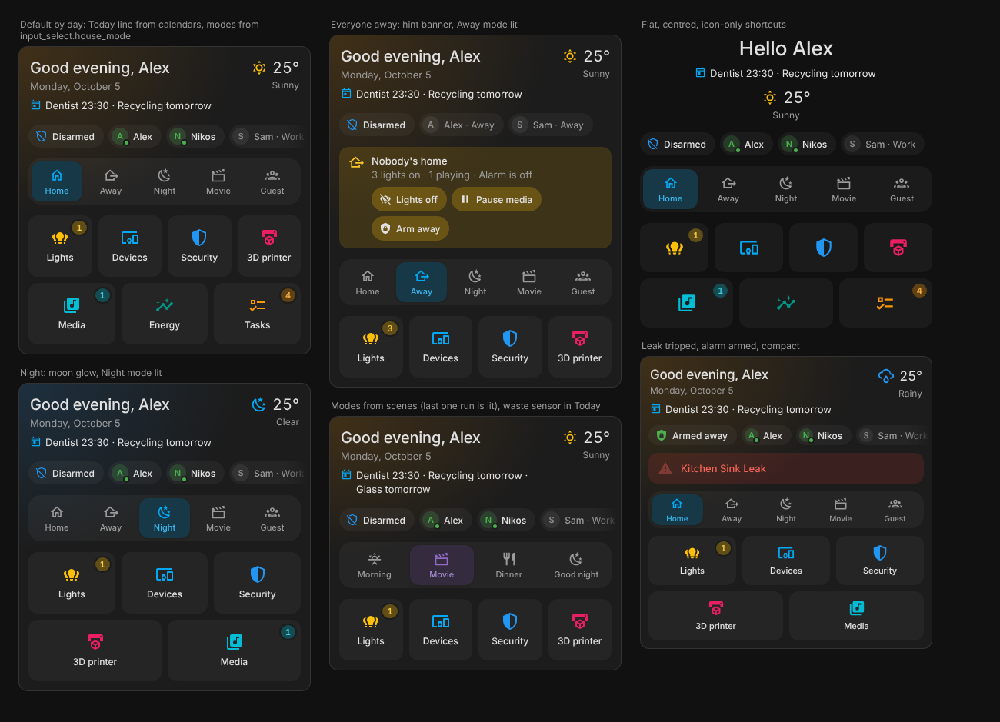
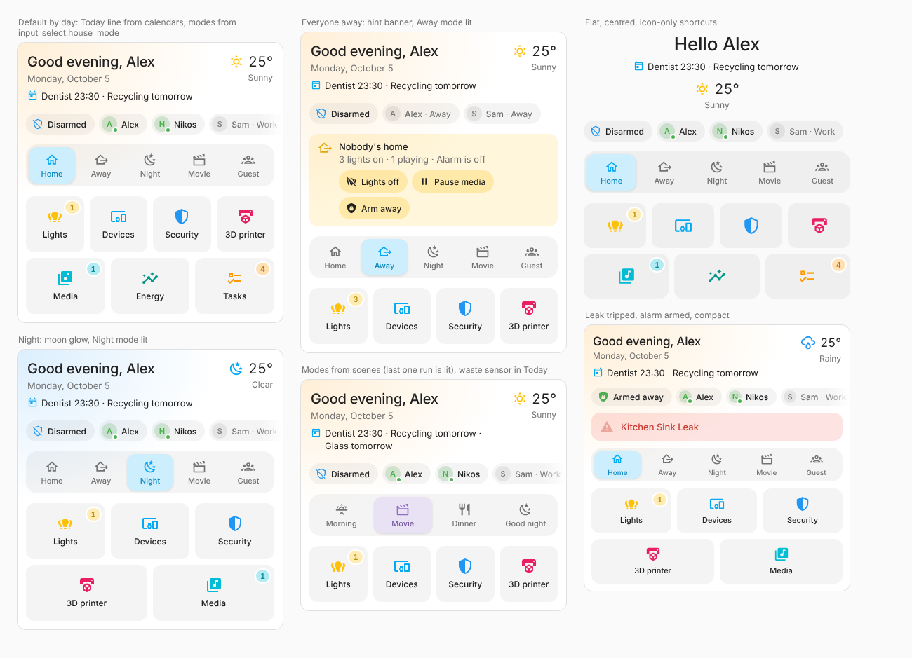

# Home Pulse Card

[](https://hacs.xyz)

The card for the top of your Home Assistant overview, built around one job: getting you to the rest of your dashboard. Large shortcut tiles are the heart of it; above them, a greeting with the weather and today's high and low, and one line with the alarm and who's home. The card stays out of the way of your area cards: it doesn't repeat what they show room by room. It speaks up only when something needs you: a tripped leak or smoke sensor, or everyone out with a window open or the lights on. Colour is kept for what means something (a problem, something open, lights on, who's home), so the card stays calm.

A soft glow in the top-left corner follows the sun: warm orange by day, cool blue at night. It is the sibling of [Area Pulse Card](https://github.com/zacharatos/area-pulse-card) (same radii, chip shape and colour rules; as the overview it gets a little more room: 16px inside instead of 12px), and it uses `ha-card`, your theme variables, the native more-info dialogs and Home Assistant's own action handler, so it sits comfortably next to the built-in cards.




## Features

- **Shortcuts first.** Large tiles with an icon and a name that take you to your other views (`navigation_path: lights` stays on the current dashboard) or run any action, with tap, hold and double-tap. Rows balance themselves (7 tiles on 4 columns → 4 + 3, 5 → 3 + 2). Optional small badges: a count (`badge: lights` → how many lights are on) or any entity's state (`badge: sensor.open_tasks`).
- **Header with a sky.** "Good evening, Timos" with today's date, and the weather on the right: icon, temperature, condition and today's high and low from the weather's own forecast (daily, twice-daily or hourly, whichever it has; nothing extra to set up). The corner glow is orange while the sun is up and blue after sunset (from `sun.sun`, or the clock without it). Your own text with `{name}` if you prefer, or centred.
- **Today line.** One quiet line under the date answers "anything to remember?": "Dentist 17:30 · Recycling tomorrow". It reads the next event of your calendars (all of them, or the ones you pick) plus any waste-collection, date, timestamp or text sensors you add, shows today and tomorrow, and disappears when there's nothing. Times follow your HA 12/24-hour setting.
- **House modes.** A row of buttons for the whole house: Home, Away, Night, Movie, Guest… with the current one raised and its icon in its colour. Point it at an `input_select` (an `input_select.house_mode` is found by itself) and you get one button per option, with icons guessed from the names in English or Greek. Or list modes that run a scene (the last one run is lit), a script, an `input_boolean` or any action.
- **One status line.** The alarm as a small chip with its state colour and icon (tap for Home Assistant's own alarm dialog with its arm buttons and keypad), then the people in your home: picture or initial, green with a dot when home, dimmed with "Away" or their zone when out.
- **Silent until it matters.** Leak, smoke, gas, CO and other safety sensors stay invisible; one that trips becomes a red line you can tap.
- **"Nobody's home" hint.** When everyone tracked is away and a door or window is open, a lock is unlocked, lights are on, music is playing or the alarm is off, one quiet banner says so with a button per fix: *Show windows* (there's nothing to do from afar, so it lists which ones), *Lock*, *Lights off*, *Pause media*, *Arm away*. The fixes touch only what is on or open.
- **Zero config.** People, weather, the alarm panel, the sun and the safety sensors are discovered. Shortcuts are the only thing to set up, in the visual editor or YAML.
- **More, if you want it.** Two opt-in blocks for people who like more on the card: the alarm as a panel with arm and disarm buttons, and a home "pulse" (lights on, windows open, what's playing, low batteries…) with a popup of exactly which ones. They're off by default because Area Pulse cards already show this per room.
- **Layouts.** `card` or `flat` (no background), `default` or `compact`, and you choose which blocks show and in what order.
- **Sections-ready and fast**, with a **visual editor** on HA's own form controls and a reorderable shortcut list, in **English and Greek**.

## Installation

### HACS (custom repository)

1. HACS → ⋮ → **Custom repositories** → add `https://github.com/zacharatos/home-pulse-card`, type **Dashboard**.
2. Search for **Home Pulse Card** → **Download**.
3. Reload the browser (clear cache if the card doesn't show up in the picker).

### Manual

1. Copy `dist/home-pulse-card.js` to `<config>/www/home-pulse-card.js`.
2. Settings → Dashboards → ⋮ → **Resources** → add `/local/home-pulse-card.js` as a *JavaScript module*.

Requires Home Assistant **2025.7+**.

## Configuration

Minimal:

```yaml
type: custom:home-pulse-card
```

Full example:

```yaml
type: custom:home-pulse-card
layout: default            # or compact
appearance: card           # or flat
sections: [greeting, status, alerts, nudges, modes, shortcuts]   # default

title: "Hello {name}"      # default: Good morning / afternoon / evening, {name}
today:                     # the Today line; omit for every calendar, false to hide
  calendars: [calendar.family, calendar.bins]
  entities:
    - sensor.waste_recycling        # waste_collection_schedule (daysTo), date/timestamp, "days" or text sensors
    - entity: sensor.next_service
      name: Boiler service
  tomorrow: true
  tap_action: { action: navigate, navigation_path: /calendar }

mode_entity: input_select.house_mode   # one button per option…
modes:                                 # …or name, reorder and colour them (optional)
  - name: Home
    color: green
  - name: Away
    color: blue
  - name: Night
    icon: mdi:weather-night
    color: indigo
  - name: Movie
    entity: scene.movie_night          # a scene instead of an option
    color: purple
show_date: true
center_greeting: false

persons: [person.alex, person.sam]   # default: everyone
show_away: true
weather_entity: weather.home            # default: first weather entity; "none" hides it
chips:
  - entity: sensor.grid_power
    name: Grid
    icon: mdi:transmission-tower
    color: teal

alarm_entity: alarm_control_panel.house # default: first alarm panel; "none" hides it
alarm_modes: [arm_home, arm_away, arm_night]   # buttons of the opt-in alarm block

pulse: [alerts, lights, doors, windows, locks, media, climate, batteries]   # opt-in block
show_inactive: false
nudges: true
battery_threshold: 20
exclude_entities: [light.christmas_tree]

columns: 4
show_names: true
shortcuts:
  - name: Lights
    icon: mdi:lightbulb-group
    navigation_path: lights        # a view of this dashboard
    badge: lights                  # number of lights on
  - name: Devices
    icon: mdi:devices
    color: amber                   # optional: an icon colour of your own
    navigation_path: devices
  - name: Security
    icon: mdi:shield-half-full
    navigation_path: security
    badge: locks                   # unlocked locks
  - name: Media
    icon: mdi:music-box-multiple
    navigation_path: media
    badge: media
  - name: Energy
    icon: mdi:chart-timeline-variant-shimmer
    navigation_path: /energy       # absolute path: another dashboard or panel
  - name: Tasks
    icon: mdi:format-list-checks
    navigation_path: todo
    badge: sensor.open_tasks       # an entity's state as the badge
  - name: Movie night
    icon: mdi:movie-open
    tap_action:
      action: perform-action
      perform_action: scene.turn_on
      target: { entity_id: scene.movie_night }
```

### Card options

| Option | Default | Description |
| --- | --- | --- |
| `layout` | `default` | `compact` tightens spacing and sizes. |
| `appearance` | `card` | `flat` drops the card background, border and padding so the blocks float on the view. |
| `sections` | `[greeting, status, alerts, nudges, modes, shortcuts]` | Blocks to show, in order. Also available: `alarm` (panel with arm/disarm buttons) and `pulse` (home-wide counts). `alerts`, `nudges` and `modes` are empty until they have something to show. |
| `title` | time-of-day greeting | Greeting text. `{name}` is the logged-in user's first name, `{greeting}` the time-of-day greeting. |
| `show_date` | `true` | Today's date under the greeting. |
| `today` | every calendar | The Today line under the date (part of `greeting`). `false` hides it. Keys: `calendars`, `entities` (ids, or `{entity, name}`), `tomorrow` (default `true`), `tap_action` (default: more-info of the first item). |
| `mode_entity` | an `input_select`/`select` named `house_mode` or `home_mode` | The mode selector. `none` turns discovery off. |
| `modes` | one per option | Mode buttons: `name`, `icon` (guessed from the name), `color` (when active), `option` (defaults to `name`), `entity` (scene, script, input_boolean, switch), `tap_action`, `hold_action`. |
| `center_greeting` | `false` | Centre the greeting, with the weather underneath. |
| `persons` | every `person` | People shown as chips, in this order. |
| `show_away` | `true` | Also show people who aren't home. |
| `weather_entity` | first `weather` | Shown beside the greeting (in the status line when the greeting is hidden). `none` hides weather. |
| `chips` | – | Extra chips: `entity` (required), `name`, `icon`, `color`, `tap_action`, `hold_action`. Default tap opens more-info. |
| `alarm_entity` | first `alarm_control_panel` | A chip in the status line, or the `alarm` block when that is shown. `none` hides the alarm. |
| `alarm_modes` | `[arm_home, arm_away]` | Arm buttons of the `alarm` block while disarmed: `arm_home`, `arm_away`, `arm_night`, `arm_vacation`, `arm_custom_bypass`. Modes the panel doesn't support are skipped. |
| `pulse` | `[alerts, lights, doors, windows, locks, media, climate, batteries]` | Groups of the opt-in `pulse` block, in order. Also available: `covers`, `fans`, `switches`. |
| `show_inactive` | `false` | Show groups with nothing active ("Doors closed", "Locked"). |
| `alert_classes` | moisture, smoke, gas, carbon_monoxide, safety, problem, tamper | Binary sensor device classes that raise the red alert line. |
| `battery_threshold` | `20` | A battery at or below this % counts as low. |
| `exclude_entities` | – | Entities the pulse ignores. |
| `nudges` | `true` | `false` turns the "Nobody's home" hints off (same as leaving `nudges` out of `sections`). Needs at least one tracked person. |
| `columns` | `4` | Maximum shortcut tiles per row (1–8). Rows are balanced. |
| `show_names` | `true` | Names under the shortcut icons; `false` for icon-only tiles. |
| `shortcuts` | – | See below. |

### Shortcuts

| Option | Description |
| --- | --- |
| `name` | Label (shown with `show_names`, and always used for accessibility). |
| `icon` | Any `mdi:` icon. Defaults to the entity's icon when `entity` is set. |
| `color` | Icon colour: a Home Assistant colour name (`amber`, `blue`, `deep-orange`…) or any CSS colour. Default: your theme's primary colour (we recommend leaving it). Badges stay neutral, except a count that means something: lights on in gold, open doors and windows in orange, unlocked locks, alerts and low batteries in red. |
| `navigation_path` | Shorthand for a navigate action. `lights` goes to the `lights` view of the current dashboard; `/lovelace/lights` or `/energy` are used as they are. |
| `badge` | A pulse group (`lights`, `windows`, `locks`, `batteries`… shows how many are active, nothing at zero) or an entity id (shows its state; hidden when `0`, `off` or unavailable). |
| `entity` | Tints the tile while this entity is on/open/playing. Without a `navigation_path` or `tap_action`, tapping opens its dialog. |
| `tap_action`, `hold_action`, `double_tap_action` | Any Home Assistant action. `tap_action` wins over `navigation_path`. |

### Theming

The card follows your theme. The corner glow uses `--hpc-glow-day` and `--hpc-glow-night`; the weather icon `--hpc-sun`, `--hpc-moon` and `--hpc-cold`. Its other colours are CSS variables you can override in a theme or with card-mod: `--hpc-accent`, `--hpc-amber`, `--hpc-red`, `--hpc-green` and friends (they default to HA's `--amber-color` etc.), `--hpc-pad` and `--hpc-gap` for the inner padding and the space between blocks (16px each; `compact` uses 10px). The alarm uses HA's `--state-alarm_control_panel-<state>-color` variables (fallbacks: blue disarmed, green armed, orange pending, red triggered). With the [Pulse theme](https://github.com/zacharatos/pulse-theme), every one of these reads the theme's shared `--pulse-*` tokens first.

## Development

```bash
npm install
npm run typecheck
npm test
npm run build      # writes dist/home-pulse-card.js
python3 -m http.server 8765   # then open http://localhost:8765/test/harness.html (?dark=1, ?lang=el)
```

The harness renders the card against an invented home with stubbed Home Assistant elements. See `AGENTS.md` for how the project is organised.

## License

MIT
